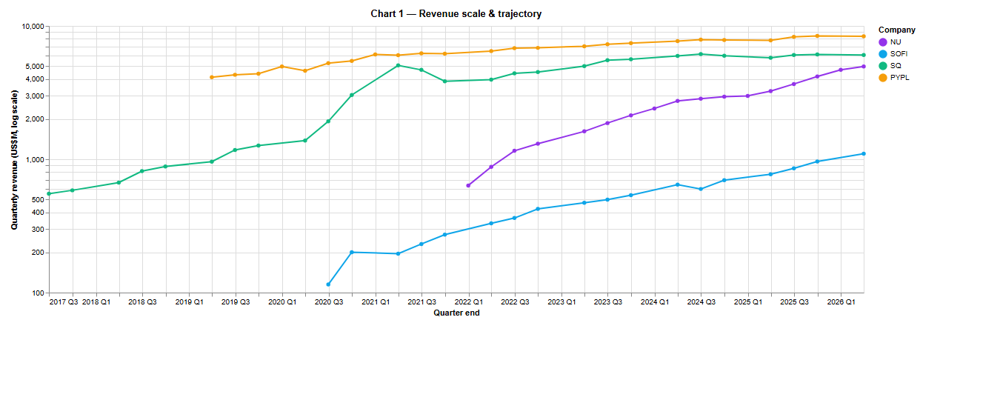
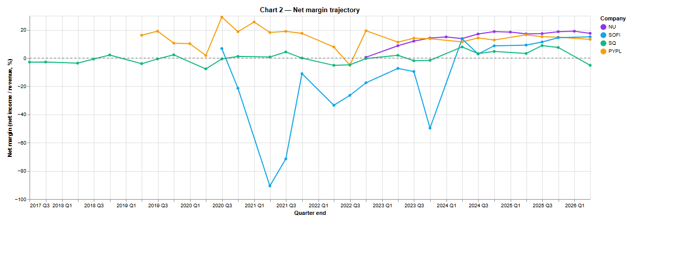
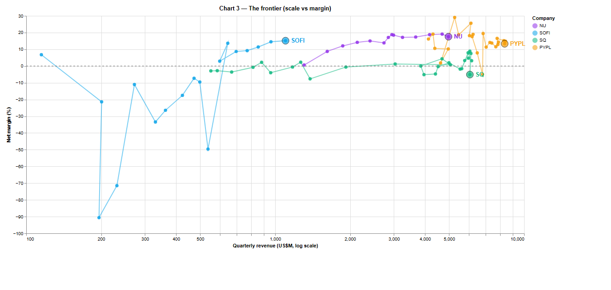
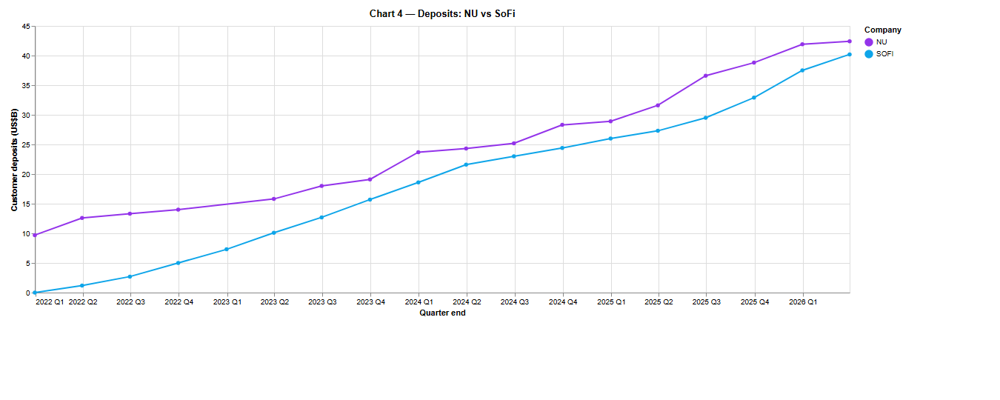
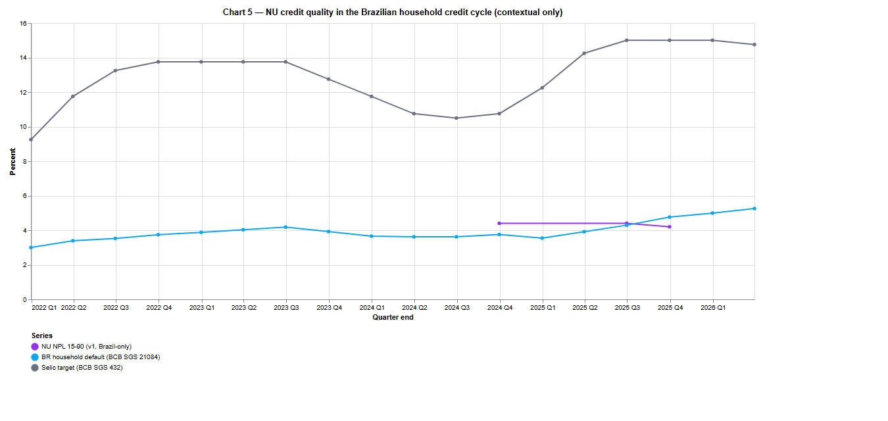

# NU Fundamentals & Signal Monitor

Brazil-first **comparative fundamentals dashboard** for Nu Holdings (NYSE: NU) and three
digital-banking peers (SoFi, Block, PayPal), built on a normalized DuckDB panel sourced
entirely from free, official data (SEC EDGAR + BCB SGS). Reproducible end-to-end; built
as a portfolio piece.

> Why Brazil-first: NU is ~92 % Brazilian by revenue and 100 % of customers are in
> Brazil / Mexico / Colombia. Tooling instrumented for US bank-switching would measure
> the wrong country. See [docs/SCOPE.md](docs/SCOPE.md).

The original Phase-3 alt-data validation track was retired on data grounds — the
intended signal has no usable history and the validation target (NU quarterly customer
net-adds) has ~3 usable observations. The decision and the analytical recast are
documented in [docs/FINDINGS.md](docs/FINDINGS.md). The project now ships **Centerpiece A**
(cross-company growth & profitability, scoped in [docs/CENTERPIECE.md](docs/CENTERPIECE.md))
as the headline deliverable, with a minimal Brazil-macro overlay as labeled context.

## Run the dashboard

- **Live hosted version:** _link forthcoming_ (Streamlit Community Cloud).
- **Locally** (no API access required — the committed `data/nu.duckdb` carries the
  panel through Q1'26):

  ```powershell
  python -m venv .venv
  .\.venv\Scripts\Activate.ps1
  pip install -e ".[dev]"
  streamlit run src\nu_monitor\app\dashboard.py
  # opens at http://localhost:8501
  ```

  No `.env` or SEC ingestion is needed to *view* the dashboard. They are only
  needed to *refresh* the panel — see "Refresh the panel from source APIs" below.

## Refresh the panel from source APIs (Windows PowerShell)

Only needed when re-ingesting NU 6-K filings, peer XBRL, or BCB SGS series. The
committed `data/nu.duckdb` already reflects the centerpiece narrative; refresh is
optional unless a new quarter has been filed.

```powershell
# 1. Create and activate a virtualenv. If PowerShell blocks activation, run once:
#    Set-ExecutionPolicy -Scope CurrentUser RemoteSigned
python -m venv .venv
.\.venv\Scripts\Activate.ps1

# 2. Install the package (editable). Required for the dashboard's absolute imports.
pip install -e ".[dev]"

# 3. SEC blocks requests without a contact email. Copy and edit:
Copy-Item .env.example .env   # then open .env and set SEC_USER_AGENT to your email

# 4. Initialize the DuckDB store, then ingest:
python -m nu_monitor              # creates data/nu.duckdb with the kpi_panel schema
python -m nu_monitor ingest-all   # NU releases -> NU IFRS backfill -> peers -> BR_MACRO

# 5. Run the test suite:
pytest

# 6. Launch the centerpiece dashboard:
streamlit run src\nu_monitor\app\dashboard.py
# then open http://localhost:8501 in a browser.
```

> **Note for dashboard maintainers.** `src/nu_monitor/app/dashboard.py` is invoked by
> Streamlit as a top-level script (`__package__=None`), so its imports must be
> **absolute** (`from nu_monitor.config import ...`). Relative imports raise
> `ImportError: attempted relative import with no known parent package` at runtime
> even though `pip install -e .` succeeds at install time. All other modules are
> reached via `python -m nu_monitor` or the `nu-monitor` console script and keep
> package context, so relative imports are fine there.

## Centerpiece — what the panel shows

**Locked question** ([CENTERPIECE.md](docs/CENTERPIECE.md)):

> *Where does NU sit on the digital-banking cohort's growth-vs-profitability frontier,
> and what does its trajectory through that space look like relative to its peers?*

A short prose companion for a manager audience — lead finding, the comparative read,
what I cut and why, limitations, forward look — lives at [docs/MEMO.md](docs/MEMO.md).

Descriptive comparative read, not a tested relationship. Every number below is computed
from `kpi_panel` rows with `definition_version='v1'`, joined per `(company, period_end)`.
Each company's window is its own full panel range; CAGRs are over that window, not a
common window — the goal is to characterize the path each company actually traced.

> **Cohort comparability — this is a useful comparison set, not a like-for-like peer
> group.** Block's revenue mix includes a large, very thin-margin Bitcoin pass-through
> (`Revenues` in XBRL is gross of Bitcoin cost of revenue), PayPal is a mature payments
> network at a different lifecycle stage, SoFi's revenue tag is `RevenuesNetOfInterestExpense`
> (net of interest, by US-GAAP convention for banks), and NU reports in IFRS. The cohort
> is informative for *scale, slope, and trajectory shape*; precise level-on-level
> comparisons should be read against [docs/DATA_SOURCES.md](docs/DATA_SOURCES.md). The
> peer panel also omits Q4 observations (XBRL calendar-frame quirk; documented), so
> Chart 2's peer lines have small Q4 gaps that NU's IFRS-backfilled line does not.

### Chart 1 — Revenue scale & trajectory



| Company | Window | Revenue, first → last | Quarterly revenue CAGR |
|---|---|---:|---:|
| **NU** | Q4'21 → Q1'26 (4.25 y) | **$636 M → $4,968 M** | **62.3 %/yr** |
| SOFI | Q2'20 → Q1'26 (5.75 y) | $115 M → $1,100 M | 48.1 %/yr |
| SQ (Block) | Q2'17 → Q1'26 (8.75 y) | $552 M → $6,057 M | 31.5 %/yr |
| PYPL | Q1'19 → Q1'26 (7.00 y) | $4,128 M → $8,353 M | 10.6 %/yr |

**NU is the fastest-growing of the four over its window.** NU's quarterly revenue
overtook SoFi's by **Q1'22** — within one quarter of NU's IPO. NU does not overtake
Block or PayPal in the panel window; at Q1'26, NU's quarterly revenue is **~82 % of
Block's** ($4,968M / $6,057M) and **~59 % of PayPal's** ($4,968M / $8,353M).

Caveat carried in the chart caption: revenue definitions are **not strictly identical**
(IFRS vs US-GAAP; SoFi's `RevenuesNetOfInterestExpense` is net of interest; Block's
`Revenues` includes Bitcoin pass-through). Read for *scale and slope*, not precise levels.

### Chart 2 — Net margin trajectory



| Company | First profitable qtr | Margin trajectory summary |
|---|---|---|
| **NU** | Q3'22 | Monotonic expansion: **0.6 % (Q3'22) → 17.5 % (Q1'26), +16.9 pp over 3.5 y** |
| SOFI | Q2'20 | Mostly monotonic: 6.8 % (Q2'20) → 15.1 % (Q1'26), +8.4 pp over 5.75 y |
| SQ | Q3'18 | **Volatile around zero, net-positive recently.** 13 / 34 panel quarters net-positive; 6 of the 7 most recent (Q1'24–Q3'25) net-positive; Q1'26 = a GAAP loss of −5.1 % driven by ~$908 M of identified one-time charges (Workforce Plan restructuring, Bitcoin remeasurement, DOJ reserve), adjusted EBITDA a record $1 B. First-to-last delta is **not representative** of trajectory; see Chart 2 line. |
| PYPL | Q1'19 | Mature plateau, slight drift: 16.2 % (Q1'19) → 13.3 % (Q1'26), −2.8 pp over 7 y |

**NU posted the largest sustained margin expansion of the four**, going from
barely-profitable in Q3'22 to ~17.5 % net margin at Q1'26 — already in the same band as
mature PayPal. SoFi expanded ~half as much (+8.4 pp). PayPal's margin has drifted down
slightly from its 2019 starting level. Block's series is too volatile for a clean
first-to-last summary; the chart line is the honest representation.

### Chart 3 — The frontier (scale × margin)



NU traces a path from the loss / small-revenue corner up to the high-margin / large-scale
region: Q3'22 sat at ($1.3 B, 0.6 %), Q1'26 sits at ($5.0 B, 17.5 %). PayPal sits in a
small mature cluster around ($7–8 B, 13–16 %). SoFi traces a similar early-stage shape
to NU but at ~1/5 the revenue scale. Block oscillates above and below zero margin at
$5–6 B revenue.

**The four paths visibly differ in starting position, slope, and direction.** The
falsification case stated in CENTERPIECE.md § 1 — "NU's path overlaps a peer's at the
same revenue scale rather than tracing a separately-shaped arc" — does not appear to
obtain: NU's trajectory from (≈$1.3 B, 0.6 %) in Q3'22 to (≈$5 B, 17.5 %) in Q1'26 is
distinct in slope from SoFi's smaller-scale early-profit cluster and from PayPal's
mature plateau. The cohort-comparability caveat above is binding here: Block sits in
the same x-range as recent-NU but **Block's near-zero margin is a function of its
revenue mix (Bitcoin pass-through gross-up), not evidence that NU is on a distinct
arc**, so we do not lean on the NU-vs-Block contrast to support the thesis. The thesis
rests on NU's distinctive trajectory shape against SoFi and PayPal; Chart 2 is the
weight-bearing visual, Chart 3 illustrates the (scale, margin) position.

(Primary rendering: single log-x panel. Small-multiples fallback is the documented
backup if the single panel ever stops reading clearly.)

### Chart 4 — Deposits: NU vs SoFi



At Q1'26: NU $42.4 B, SoFi $40.2 B → **NU / SoFi = 1.05×**.

The interesting fact this puts on the page: NU and SoFi run a **near-parity deposit
book** while NU operates at roughly **4.5× SoFi's revenue scale** ($4,968M / $1,100M).
NU extracts substantially more revenue per dollar of deposits than SoFi does — a real
structural difference between these two deposit-funded digital banks, not an
artifact of the panel.

### Chart 5 — Brazil-context overlay (contextual only)



NU NPL 15-90 v1 (Brazil-only definition) is shown alongside BCB household default
(SGS 21084) and Selic target (SGS 432) for Q4'21 → Q1'26. **No relationship is claimed
— the v1 NPL has three same-definition observations, which cannot establish one.** The
panel exists to put NU's geographic context on the page, and only that.

### Methodology — see the dashboard's back-matter section

Heterogeneous-source reconciliation into one panel; the Q4'25 NU column-format change
defense; `definition_version` versioning for redefined metrics; managerial-vs-statutory
revenue resolution; the IFRS Q4 derivation (FY − 9 M) cross-validated against the release;
the Q4'22 hole; per-filer XBRL tag choices; BCB API quirks. Full details in
[docs/DATA_SOURCES.md](docs/DATA_SOURCES.md).

## Known discontinuities — read before comparing

A few things would silently mislead a reviewer who didn't know them. Full details and
source quotes live in [docs/DATA_SOURCES.md](docs/DATA_SOURCES.md); the short version:

- **Revenue definition (Q4'25+): managerial vs statutory.** NU's new-format earnings
  release introduces a "Managerial P&L" whose `Total Revenue` differs from the statutory
  IFRS `Total revenue` by ~+3.5 % (Q4'25: managerial 4,857.3 vs IFRS 4,685.9 $M). Net
  income is identical under both. **We use statutory IFRS** as the canonical `revenue`
  so the series is uniform across all quarters and more peer-comparable.
- **Efficiency ratio — redefined at Q4'25** (~27.7 % → 17.6 %; a methodology change, not
  improvement). Stored as separate `v1`/`v2` series via the `definition_version` column.
  **Never chart `efficiency_ratio` v1 and v2 as one line** without an explicit caveat.
  Same versioning applied to `npl_15_90` / `npl_90_plus` (Brazil-only → consolidated).
- **One quarter is genuinely unfillable: Q4'22.** Both the earnings release and the
  financial-statements exhibit fail for Q4'22 (the release was published as slide images
  with no machine-readable text; `nufs4q22` is not actually a financial-statements doc).
  FY2022 audited figures live in the 20-F, out of v1 scope. Documented in
  [docs/DATA_SOURCES.md § Q4'22](docs/DATA_SOURCES.md#q422--the-one-unfillable-hole).

## Status

- [x] Phase 0 — scaffold + schema
- [x] Phase 1 — EDGAR ingestion + KPI panel (NU 6-K parse + IFRS backfill + peer XBRL)
- [x] Phase 2 — Brazil macro layer (Selic + PF household default, BCB SGS only — minimal context overlay)
- [x] Phase 3 — centerpiece analysis (Centerpiece A; see [docs/CENTERPIECE.md](docs/CENTERPIECE.md))
- [x] Phase 4 — Streamlit dashboard (4 charts + Brazil overlay)
- [x] Phase 5 — polish pass: axis/legend cleanup, README screenshots embedded
